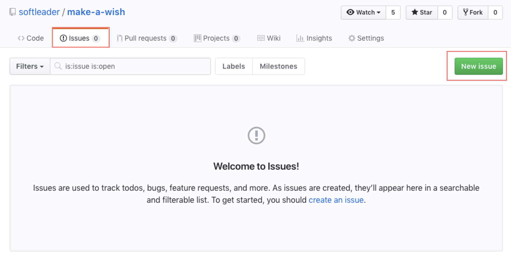
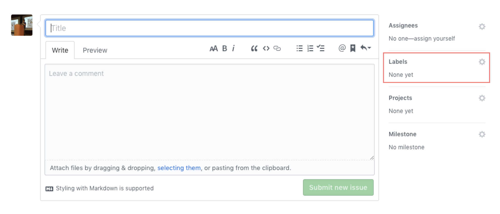
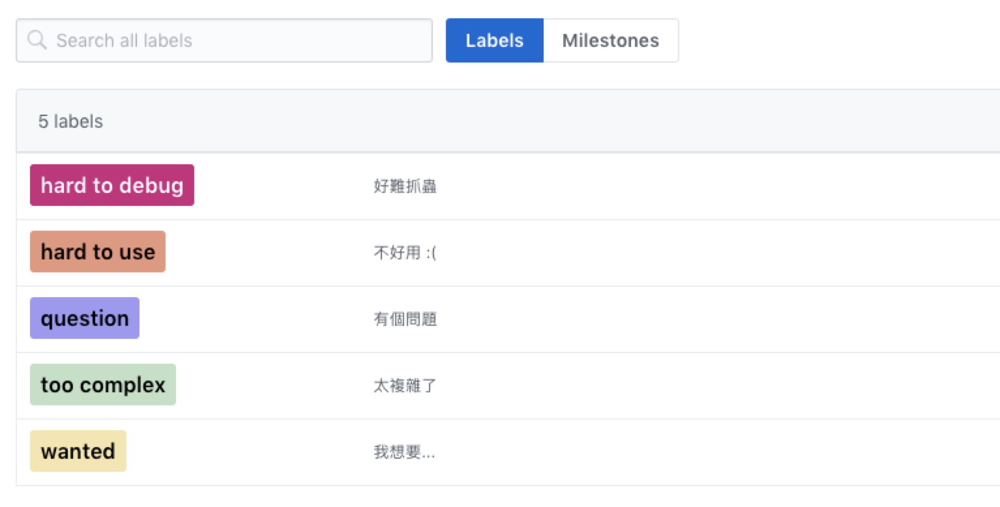

# make-a-wish

SoftLeader Framework v3 許願所

## Why

Hi Folks,

目前 r&d 正在著手規劃及開發新版的 SoftLeader Framework v3, 想收集過去一直使用 v2 各位的想法: 不論是不好用, 太複雜, 太難 debug 等, 或是自己的想法, 甚至覺得某個設計不錯應該擴大規劃等等都可以分享.

許願所會開張持續到至少明年 Q2, 任何一點 Feedback 對我們來說都是非常重要的參考指標, Please feel free to leave any comments or questions.

## How

這次主要將使用 GitHub 的 [Issue](https://github.com/softleader/make-a-wish/issues) 來收集:

1. 點選 Issue > New Issue

1. 寫個聳動的 Title 及 Comment 吧, Comment 區塊也支援 [Markdown格式](https://guides.github.com/features/mastering-markdown/), 另外記得要標記 Label 喔

1. Label 一共區分為以下幾種, 沒有符合的就先不選吧, 想要新的 Label 也可以開一個 Issue 喔!

