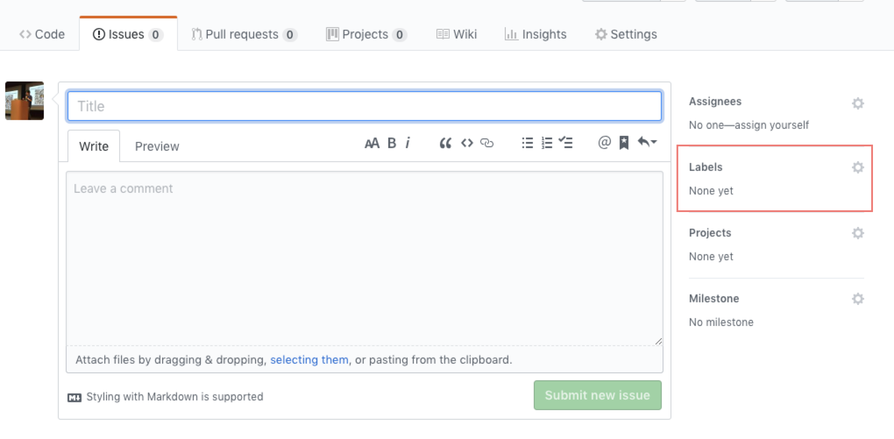

# make-a-wish

Next-generation SoftLeader Framework 許願所

## Why

Hi Folks,

各位專案上正在使用的 SoftLeader Framework v2 從剛推出到現在已經 3 年多, 因應 Spring 5 的推出, Java 的升級, 以及這兩年出現的 Microservice 架構等等, R&D 正在著手規劃及開發下一代的的 SoftLeader Framework

在下一代中除了會整合許多新推出的技術或 Library 外, 還有一個很重要的目標就是讓 SoftLeader Framework 一代比一代更好用, 因此希望可以收集各位的想法: 不論是過去 v2 版本中不好用, 太複雜, 太難 debug 等地方, 或是想提供自己的想法, 甚至覺得某個設計不錯應該擴大規劃等等都請分享給我們.

許願所至少會持續開張到 2019/Q2, 任何一點 Feedback 對我們來說都是非常重要的參考指標, Please feel free to leave any comments or questions.

## How

這次主要將使用 GitHub 的 [Issue](https://github.com/softleader/make-a-wish/issues) 來收集:

1. 點選 Issue > New Issue

1. <寫個聳動的 Title 及 Comment 吧, Comment 區塊也支援 [Markdown格式](https://guides.github.com/features/mastering-markdown/), del>另外記得要標記 Label 喔</del> (label會由小精靈為你標上)

1. <del>Label 一共區分為以下幾種, 沒有符合的就先不選吧, 想要新的 Label 也可以開一個 Issue 喔!</del> 小精靈你自己去開 Label 吧!

